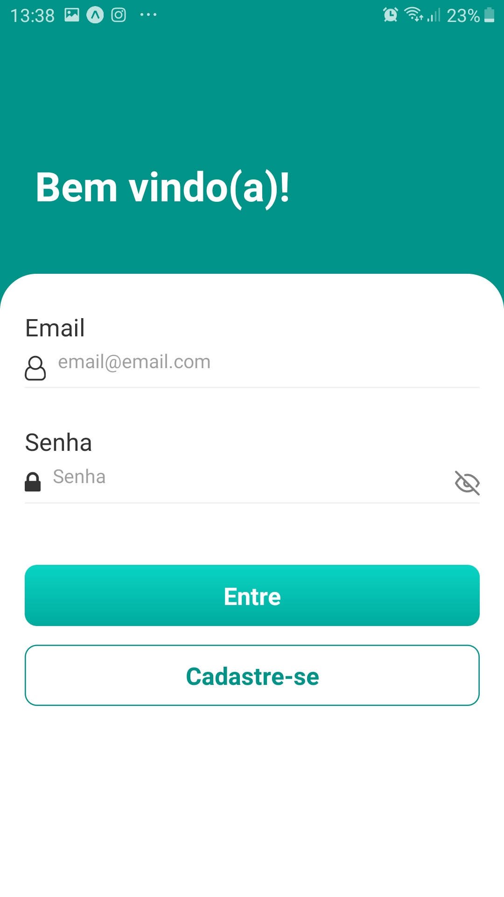
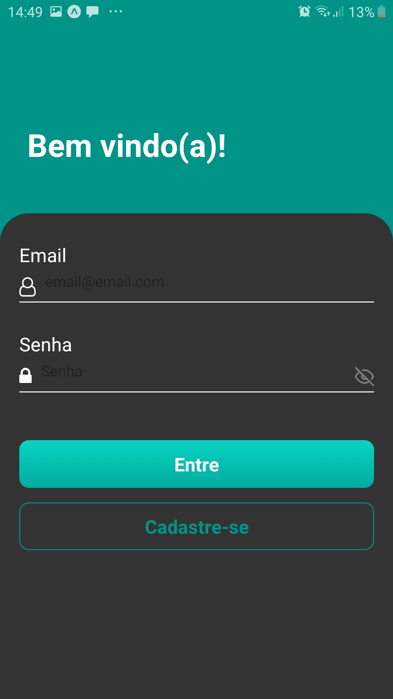
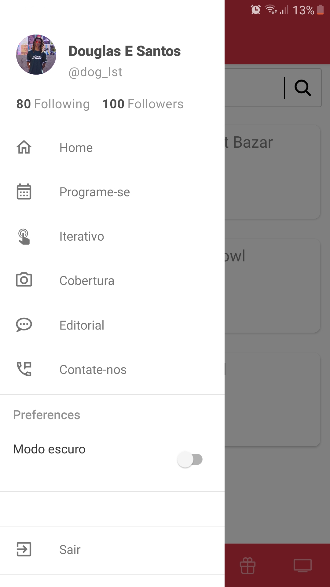
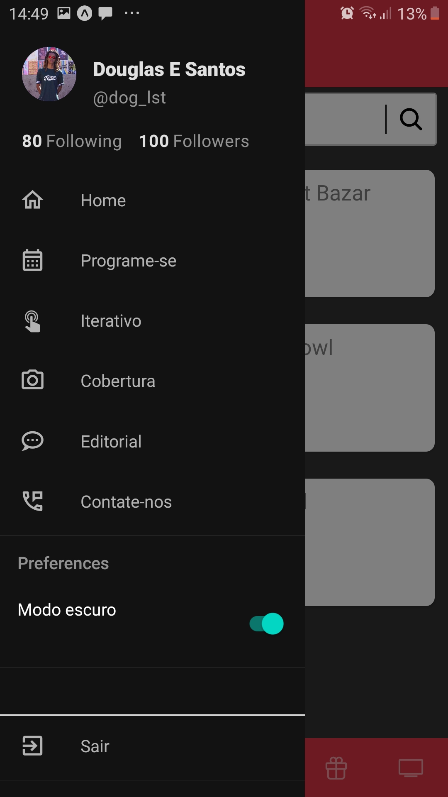
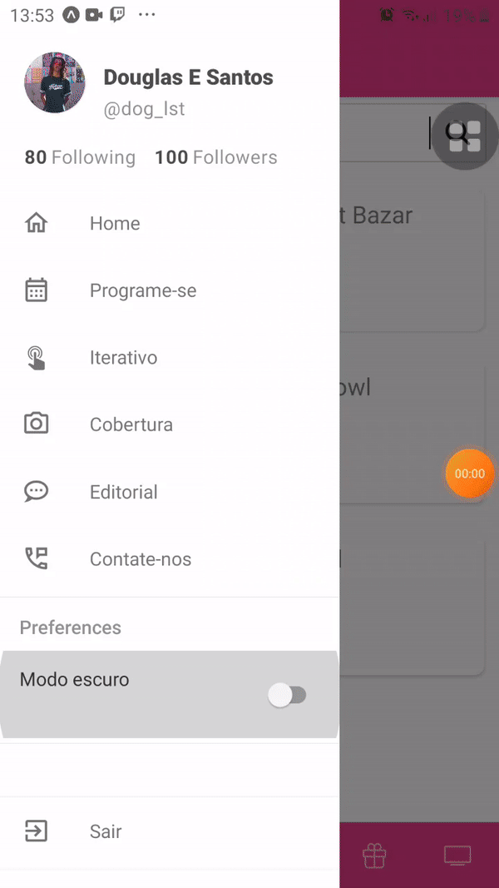
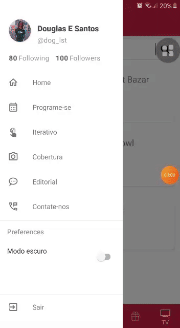

<h1 align="center">
 
Template 
</h1>

📲An application showing the schedule of events that may be of interest to locals or tourists 📲

  

## Screenshot 📷

-📌 **Onboarding**
<pre>

                                    

</pre>

-📌 **Login**
<pre>
                                    

</pre>

-📌 **Logon**
<pre>
                                    

</pre>
### Side Menu
<pre>
                                       
</pre>

## Demo 📷

-📌 **Initial Screens**
<pre>

                                    

</pre>

-📌 **Bottom Tab Navigation**
<pre>
                                           

</pre>

-📌 **Side Menu Navigation**
<pre>
                                           

## Features 🗃️
This app features all the latest tools and practices in mobile development!

- **React-Native** 
- **Expo**
- **React-Native Navigation 5**

## License 📃

This project is licensed under the MIT License - see the [LICENSE](https://opensource.org/licenses/MIT) page for details.
